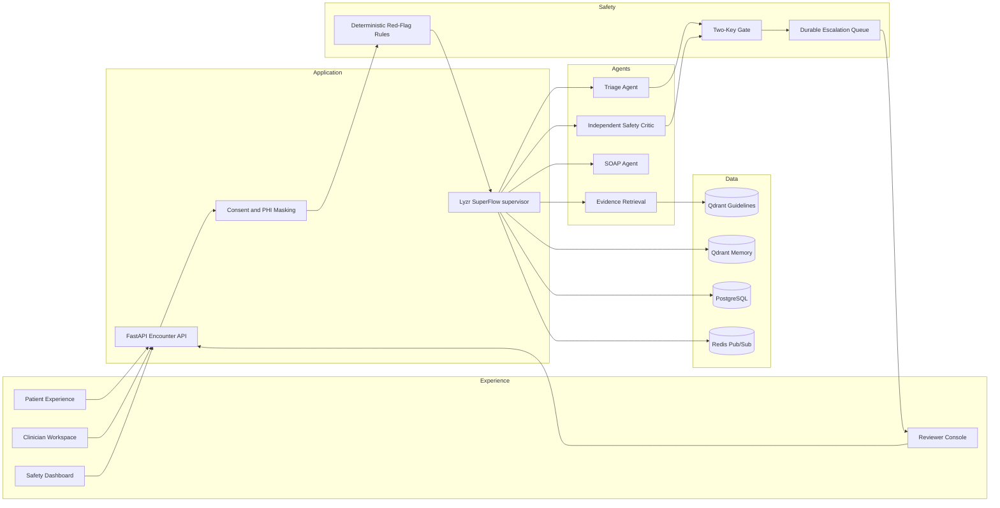
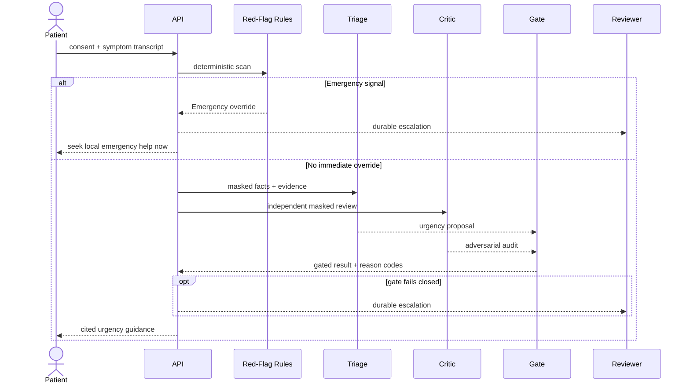

# CareRelay architecture

The refined source has exactly 19 logical nodes. They remain explicit boundaries in one SPA and one FastAPI process for the MVP:

| Source node | MVP boundary |
|---|---|
| Clinician Workspace | `/clinician`, `ClinicianPage`, `SoapEditor` |
| Clinician Reports | `/clinician/reports`, list/detail/export, versioned SOAP |
| Patient Experience | `/patient`, `PatientPage` |
| Clinical Escalation Console | `/reviewer`, `ReviewerPage` |
| Safety Dashboard | `/admin`, `AdminPage` |
| API Gateway | Nginx container + FastAPI middleware/RBAC |
| Encounter API & Stream | `/api/v1/encounters`, scoped WebSockets |
| Encounter Supervisor | `EncounterService` with live Lyzr SuperFlow execute/poll adapter and explicit local demo fallback |
| Intake & Triage Agent | typed `AgentProvider.triage` |
| Independent Safety Critic | typed `AgentProvider.critique` |
| Red-Flag Rules Engine | `RedFlagEngine` + versioned YAML |
| Qdrant Guidelines | tenant-specific named dense/sparse collection |
| Qdrant Encounter Memory | separate tenant-specific named dense/sparse collection |
| PostgreSQL Operational Store | SQLAlchemy repositories + Alembic |
| Two-Key Safety Gate | deterministic `safety_gate` |
| Scribe & SOAP Agent | typed `AgentProvider.document` + sentence provenance |
| Observability & Evaluation | audit/admin metrics + operations MCP adapter |
| Consent & Privacy Service | consent route + `mask_phi` boundary |
| Escalation Queue (DLQ) | durable PostgreSQL escalation records; Redis event fan-out |
| Evidence Retrieval Agent | `QdrantRetrievalProvider` with in-memory fallback |
| Clinician Reports | `/clinician/reports*` APIs + UI; versioned SOAP; HTML export |

### Clinician reports

Denormalized encounter columns (`urgency`, `report_status`, `assigned_clinician_id`, `updated_at`) enable SQL filter/pagination. Table `soap_revisions` stores immutable signed versions; edits after sign create a new draft revision. Report list/detail/export endpoints are tenant-scoped and audit-logged. Redis short-TTL cache invalidates on encounter save. Escalations are priority-sorted with SLA age/breach and resolution categories.

