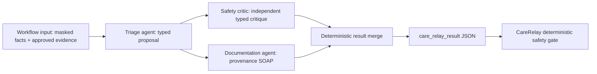

# CareRelay Lyzr SuperFlow contract

CareRelay uses one deployed Lyzr SuperFlow as its live multi-agent supervisor. The flow performs bounded agent work; CareRelay's deterministic rules and two-key safety gate always run outside Lyzr.

## Recommended flow



Configure fixed ordering for triage before critic, allow documentation to run only from the supplied facts/evidence, and make the final node return one JSON object. Do not add diagnosis, prescribing, autonomous EHR write-back, Cloud MCP, or the final urgency gate to the workflow.

## Input

The execute request supplies an `input` array containing one object:

```json
{
  "schema_version": "1.0",
  "contract": "care_relay_orchestration_v1",
  "run_ref": "opaque sha256 reference",
  "reported_facts": "text with common PHI masked",
  "evidence": [],
  "constraints": {
    "allowed_urgency": ["Emergency", "Same-Day", "Routine", "Self-Care"],
    "no_diagnosis": true,
    "no_treatment": true,
    "one_final_json_object": true
  }
}
```

`run_ref` is not the tenant or encounter identifier. Evidence contains only CareRelay-curated citation objects. Demo scenario answers are never sent to Lyzr.

## Required output

The final node must return `care_relay_result` matching `packages/api-types/lyzr-superflow-output.schema.json`:

```json
{
  "care_relay_result": {
    "triage": {
      "schema_version": "1.0",
      "provider": "lyzr",
      "urgency": "Routine",
      "confidence": 0.88,
      "uncertainty": 0.12,
      "rationale_summary": "Urgency-only summary grounded in supplied facts.",
      "missing_critical_facts": [],
      "citations": []
    },
    "critic": {
      "schema_version": "1.0",
      "provider": "lyzr",
      "proposed_urgency": "Routine",
      "risk_found": false,
      "confidence": 0.91,
      "reason_codes": [],
      "summary": "Independent safety critique summary."
    },
    "soap": {
      "status": "draft",
      "sections": {
        "subjective": [],
        "objective": [],
        "assessment": [],
        "plan": []
      }
    }
  }
}
```

Every SOAP sentence needs `text`, `confidence`, and at least one provenance link. Permitted `source_id` values are `TRANSCRIPT-1`, `SYSTEM`, or one of the supplied evidence `source_id` values. Unsupported sources are replaced with an explicit “Incomplete” sentence. CareRelay overwrites returned triage citations with its own retrieved evidence, validates urgency and numeric bounds, rejects semantically inconsistent critic output, and fails closed on any contract error.

## Runtime lifecycle

CareRelay submits `POST /workflows/execute`, stores the returned execution ID, and polls `GET /executions/{execution_id}` until a terminal state or the configured timeout. Only `completed` continues. `failed`, `cancelled`, `paused`, timeout, malformed output, and HTTP errors create an audited failed orchestration run and force at least Same-Day human review. The admin verifier uses `GET /workflows/{workflow_id}`.
